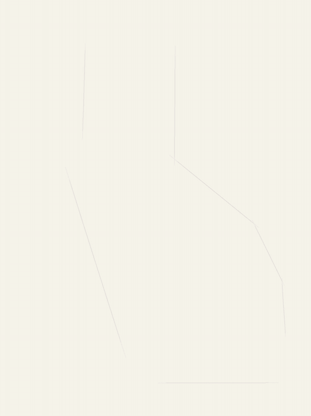
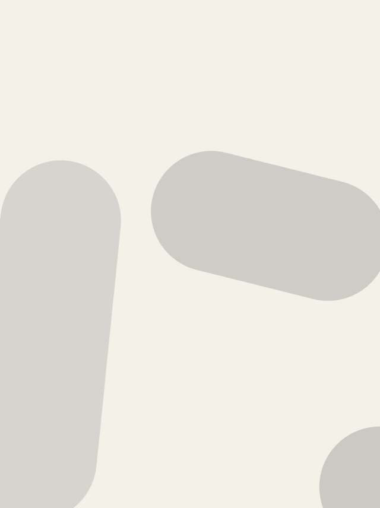
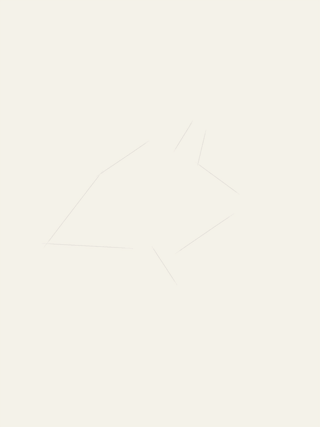
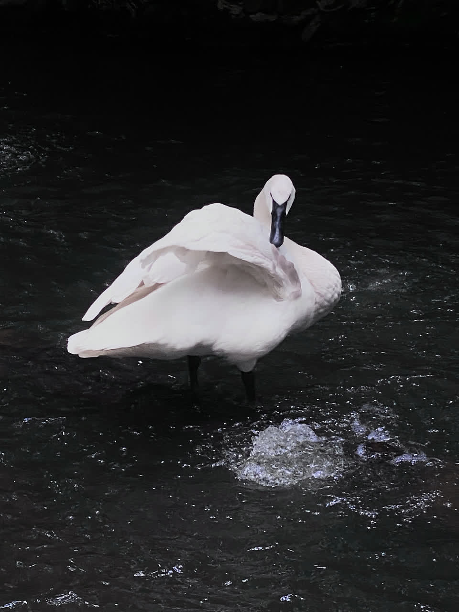

# painterly

Photo → painting, stroke by stroke — the way an artist would actually paint it.

Painterly is a stroke-based renderer: it plans thousands of individual brush strokes with classical graphics techniques, uses monocular depth and saliency models to understand the scene, and then paints in a human order — construction sketch, wash, subject before background, faces one at a time with the eyes sharpest, detail finished patch by patch. It outputs the final painting plus a build-up timelapse of every stroke. No neural style transfer, no video model: every frame is real strokes landing on a canvas, and the whole run is deterministic (same photo + seed = same painting, byte for byte).

<p align="center">
  
  &nbsp;
  
</p>

## How it works

**1. Stroke engine — Hertzmann '98, modernized.** The core loop is Aaron Hertzmann's [*Painterly Rendering with Curved Brush Strokes of Multiple Sizes*](https://www.dgp.toronto.edu/papers/aherzmann_SIGGRAPH1998.pdf) (SIGGRAPH 1998): five brush radii paint coarse-to-fine, and each layer only places strokes where the canvas still differs from a blurred reference of the photo (area-error seeding).

**2. Stroke shape, orientation, and texture.** Raw Hertzmann strokes wander like worms. Three fixes:
- Strokes follow an **Edge Tangent Flow** field ([Kang, Lee & Chui, *Coherent Line Drawing*, NPAR 2007](https://dl.acm.org/doi/10.1145/1274871.1274878)), with the smoothing kernel scaled to the brush radius, so neighboring strokes stay locally parallel like real brushwork.
- Each stroke is reduced to a **single quadratic Bézier** with a total turn budget (~60°) — the stroke parameterization used by modern neural painters ([Paint Transformer, ICCV 2021](https://arxiv.org/abs/2108.03798); [Stylized Neural Painting, CVPR 2021](https://arxiv.org/abs/2011.08114); [Learning to Paint, ICCV 2019](https://arxiv.org/abs/1903.04411)).
- Strokes render as **tapered, bristle-textured ribbons**: a procedural bristle texture is warped along the spine in perspective quads (the rendering mechanism from Stylized Neural Painting), with wet blending against the canvas underneath.

**3. Pen pressure from handwriting research.** Width and opacity taper along each stroke with a lognormal velocity profile (Plamondon's kinematic theory of rapid human movements), and stroke width responds to curvature via the [two-thirds power law](https://pubmed.ncbi.nlm.nih.gov/6666128/) (Lacquaniti, Terzuolo & Viviani, 1983) — fast straight passages go thin and dry, slow curves press wider.

**4. Scene understanding decides where detail goes.** [Depth Anything V2](https://arxiv.org/abs/2406.09414) provides relative depth; a [BiRefNet](https://arxiv.org/abs/2401.03407) matte provides subject saliency. Depth is quantized into paint groups (with saliency promoting the subject to the top group), so the background is painted far-to-near with big loose strokes while the subject gets the fine brushes. YuNet face detection with eye landmarks gives faces an extra-fine pass and the eyes the finest brush of all.

**5. The painter's ordering.** The part that makes the timelapse feel human, guided by [Paints-UNDO](https://github.com/lllyasviel/Paints-UNDO), the [Time-Map digital painting dataset](https://cragl.cs.gmu.edu/timemap/), and portrait-painting tutorials:
- a light-gray **construction sketch** — long straight rough lines, restated passes with hand wobble, mocked pen pressure, the occasional wrong line that gets undone. The sketch lives on an overlay and is never baked into the painting; it disappears only where paint physically covers it (a per-pixel cover map, not a timer);
- a thin **wash** under the drawing;
- the **subject's base coat before the background** gets anything past the wash;
- **faces one at a time**, largest first, coarse-to-fine with the eyes leading each layer, while coarse block-in strokes land elsewhere so the canvas keeps growing around them — the background's base only starts once the faces are mostly done;
- bodies refined through **anatomical zones** (hair and head, then downward), never in concentric machine-like rings;
- small brushes finish **one patch before moving to the next**;
- a few bright **accent highlights** at the very end.

Finished faces are protected by per-face soft masks, so no later stroke can ever smear them.

## From first version to final

It took 23 tagged versions to get the process right. Same engine skeleton, same photo:

| v1 — the phases existed, but | final |
| --- | --- |
| worm-like meandering strokes | flow-aligned Bézier ribbons with pressure taper |
| machine-perfect contour-traced sketch | sparse straight rough lines, restated, with undo |
| detail raining in randomly everywhere | painter's ordering: faces → zones → patches |
| depth planes showing hard seams | feathered soft masks between paint groups |
| uniform treatment of every region | depth + saliency + face-gated detail |

<p align="center">
  
  &nbsp;
  
</p>

It generalizes past portraits — subject-first ordering and depth grouping come from the models, not per-image tuning:

<p align="center">
  
  &nbsp;
  
</p>

## Usage

Requires Python 3.11+ and [uv](https://docs.astral.sh/uv/).

```sh
uv sync
uv run painterly examples/golden.jpg            # painting.png + timelapse.mp4 in out/golden/
uv run painterly photo.jpg -o out/mypainting --size 1080 --seed 3
```

Useful flags:

| flag | what it does |
| --- | --- |
| `--size N` | long-edge working resolution (default 1080) |
| `--seed N` | reroll the stroke plan |
| `--device auto\|mps\|cuda\|cpu` | depth model device (default `auto`: MPS > CUDA > CPU) |
| `--face-flow one-go\|v11\|together` | how faces are scheduled (default `one-go`) |
| `--no-video` | skip the timelapse, just render the painting |
| `--classic` | plain Hertzmann strokes, no flow field or ribbons |
| `--flat` | untextured flat strokes |

The first run downloads Depth Anything V2 (small) from Hugging Face; BiRefNet and YuNet weights are vendored or fetched once, and per-image model outputs are cached in `~/.cache/painterly`, so re-renders of the same photo skip straight to stroke planning. A 1080p painting with its 20-second timelapse takes about a minute on an M-series Mac. Cross-platform: the depth model picks MPS, CUDA, or CPU automatically (`--device` overrides), and everything else is OpenCV + ONNX Runtime, so macOS, Linux, and Windows all work.

## Layout

```
src/painterly/
  maps.py       depth / saliency / face maps, caching
  strokes.py    stroke generation: layers, ETF, Bézier, face & eye passes
  sketch.py     construction-sketch extraction and human-style restating
  order.py      the painter's ordering
  render.py     ribbon rasterizer, pressure, masks, wet blending
  timelapse.py  stroke scheduling and video writer
  cli.py        entry point
```
